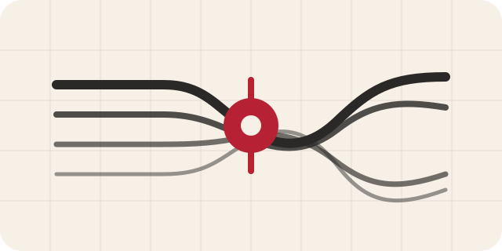

<div align="center">
  
  <h1>Polish Writing Skills</h1>
  <p><strong>Naturalna polszczyzna dopasowana do gatunku i sytuacji — bez zmiany sensu.</strong></p>
  <p>Otwarty Agent Skill do redagowania i tłumaczenia tekstów na naturalny język polski z rygorystycznym zachowaniem faktów.</p>
  <p>
    <a href="https://agentskills.io"></a>
    
    <a href="LICENSE"></a>
    <a href="https://skills.sh/RobTar97/polish-writing-skills"></a>
  </p>
  <p>
    <a href="#szybka-instalacja"></a>
    <a href="README.md"></a>
  </p>
</div>

---

## Jeden skill, jedna zasada redakcyjna

Skill poprawia polszczyznę, ale nie zmienia po cichu tego, co mówi tekst.

<table>
  <tr>
    <td width="100%" valign="top">
      
      <h3><a href="skills/natural-polish-writing/SKILL.md">natural-polish-writing</a></h3>
      <p>Naturalna, współczesna polszczyzna dla tekstów poza interfejsem użytkownika.</p>
      <p><strong>Najlepszy wybór do:</strong> artykułów, treści internetowych i marketingowych, wiadomości, ogłoszeń, postów społecznościowych, tekstów akademickich oraz tłumaczeń na język polski.</p>
    </td>
  </tr>
</table>

> W przypadku strukturyzowanych zasobów UI lub korespondencji wymagającej szczególnego wyczucia relacji skill wykonuje bezpieczną korektę językową i wskazuje zakres, który wymaga specjalistycznej lokalizacji albo redakcji biznesowej.

## Szybka instalacja

Zainstaluj skill z repozytorium za pomocą oficjalnego narzędzia [skills CLI](https://skills.sh/docs/cli) (zalecane):

```bash
npx skills@latest add RobTar97/polish-writing-skills
```

Zainstaluj bezpośrednio konkretny skill:

```bash
npx skills@latest add RobTar97/polish-writing-skills --skill natural-polish-writing
```

Zainstaluj globalnie dla Codexa bez dodatkowych pytań:

```bash
npx skills@latest add RobTar97/polish-writing-skills --skill natural-polish-writing -g -a codex -y
```

Sprawdź, co CLI wykrywa w repozytorium, zanim coś zainstalujesz:

```bash
npx skills@latest add RobTar97/polish-writing-skills --list
```

Jeśli wolisz stałe polecenie, zainstaluj to samo otwarte CLI przez npm:

```bash
npm install -g skills
skills add RobTar97/polish-writing-skills --skill natural-polish-writing
```

Uruchom skill jednorazowo bez instalacji:

```bash
npx skills@latest use RobTar97/polish-writing-skills@natural-polish-writing
```

## Zobacz, jak działa

Ten przykład pokazuje, co się zmienia, co pozostaje bez zmian i czego skill nie dopowiada.

<table>
  <tr>
    <td width="50%" valign="top">
      <h3>Przed</h3>
      <p>W dzisiejszych czasach warto zauważyć, że Plan Pro stanowi kompleksowe rozwiązanie, które pozwala 12 osobom wspólnie planować zadania. Ponadto okres próbny trwa 14 dni, a abonament kosztuje 29 zł miesięcznie. Należy jednak pamiętać, że Plan Pro nie działa bez połączenia z internetem.</p>
    </td>
    <td width="50%" valign="top">
      <h3>Po</h3>
      <p>Plan Pro umożliwia 12 osobom wspólne planowanie zadań. Okres próbny trwa 14 dni, a po jego zakończeniu abonament kosztuje 29 zł miesięcznie. Do korzystania z Plan Pro potrzebne jest połączenie z internetem.</p>
    </td>
  </tr>
</table>

**Zachowano:** nazwę produktu, limit 12 osób, 14-dniowy okres próbny, cenę 29 zł miesięcznie oraz wymóg połączenia z internetem.

**Zmieniono:** ogólnikowe wprowadzenie, niepopartą konkretami ocenę marketingową, powtarzalne łączniki i pustą ramę ostrzegawczą. Nie dodano żadnej funkcji, dowodu, presji ani obietnicy.

To przejrzysty przykład redakcyjny, a nie wynik automatycznego benchmarku. Kontrola odpowiada [priorytetom redakcyjnym](skills/natural-polish-writing/references/editing-priorities.md) i [liście kontrolnej](skills/natural-polish-writing/references/review-checklist.md) skilla.

## Wypróbuj

```text
Użyj $natural-polish-writing, aby ten komunikat brzmiał naturalnie i zwięźle po polsku.
Zachowaj wszystkie fakty, liczby, warunki i zastrzeżenia.
```

```text
Użyj $natural-polish-writing, aby przetłumaczyć ten artykuł na współczesny język polski.
Zachowaj terminologię, cytaty, stopień pewności i głos autora.
```

```text
Użyj $natural-polish-writing, aby zredagować ten fragment po polsku.
Zachowaj wszystkie fakty i nie wygładzaj celowo nieformalnego tonu.
```

## Jak podejmuje decyzje

- **Najpierw sens, później płynność.** Fakty, warunki, stopień pewności, chronologia, liczby, nazwy, atrybucja, cytaty, zobowiązania i konsekwencje pozostają bez zmian.
- **Najpierw gatunek, później ogólna poprawność stylu.** Tekst akademicki, reklama, post, komunikat i tłumaczenie wymagają różnych decyzji.
- **Najmniejsza wystarczająca zmiana.** Skill poprawia miejsca, które tego potrzebują, zamiast zastępować rozpoznawalny głos anonimowym „dobrym stylem”.
- **Bez udawania człowieka.** Nie dodaje anegdot, opinii, slangu, literówek, dowodów ani fikcyjnych doświadczeń.
- **Aktualne zasady, dane użyte w kontekście.** Pisownia i interpunkcja opierają się na zasadach RJP obowiązujących od 2026 roku; NKJP i WSJP wspierają opisowe decyzje dotyczące użycia i łączliwości.
- **Bez obietnic dotyczących detektorów.** „Brzmienie jak AI” jest sygnałem jakości redakcyjnej, a nie dowodem autorstwa ani celem obchodzenia detekcji.

## Sposób zwracania wyników

Gotowy tekst jest po polsku. Uwagi są formułowane w języku polecenia i pojawiają się tylko wtedy, gdy znaczenie ma przyjęte założenie, nierozstrzygnięta wieloznaczność, ostrzeżenie dotyczące zachowania treści albo granica zakresu.

| Język polecenia | Gotowy tekst | Uwagi |
| --- | --- | --- |
| Polski | Polski | Polski |
| Angielski lub inny | Najpierw gotowy tekst po polsku | Potem zwięzłe uwagi w języku polecenia |

## Źródła i hierarchia autorytetu

Skill odróżnia normy językowe od preferencji redakcyjnych:

- [Rada Języka Polskiego](https://rjp.pan.pl/zasady-pisowni-i-interpunkcji-polskiej-2/) — aktualna pisownia i interpunkcja.
- [Narodowy Korpus Języka Polskiego](https://nkjp.pl/) — opisowe dane korpusowe.
- [Wielki słownik języka polskiego PAN](https://wsjp.pl/) — znaczenia, gramatyka, kwalifikatory stylistyczne i typowe połączenia.
- [Zasady prostego języka na Gov.pl](https://www.gov.pl/web/cyfryzacja/prosty-jezyk) — wskazówki dla tekstów publicznych i instruktażowych, a nie uniwersalny wzorzec stylu.

## Struktura repozytorium

```text
assets/
├── natural-writing.svg
└── readme-hero.png
skills/
└── natural-polish-writing/
    ├── agents/
    │   └── openai.yaml
    ├── references/
    └── SKILL.md
```

Publiczna część pakietu obejmuje wyłącznie instalowalny skill, potrzebne mu materiały referencyjne oraz zasoby prezentacyjne repozytorium. Raporty badawcze i materiały robocze pozostają poza pakietem.

## Licencja

Treści utworzone w tym repozytorium są dostępne na warunkach [licencji MIT](LICENSE). Materiały referencyjne odsyłają w razie potrzeby do źródeł urzędowych i specjalistycznych; treści osób trzecich nie są tu przedrukowywane ani ponownie licencjonowane.

<div align="center">
  <sub>Skill dla polszczyzny, która szanuje zdanie, autora i prawdę.</sub>
</div>
