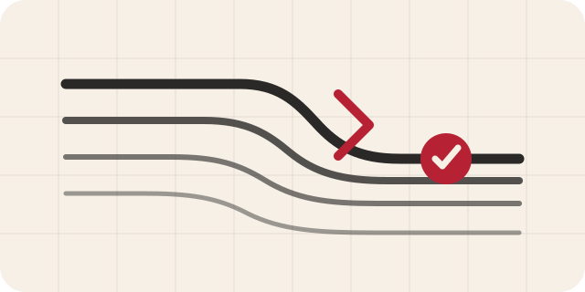

<div align="center">
  
  <h1>Polish Writing Skills</h1>
  <p><strong>Naturalna polszczyzna — i teksty funkcjonalne, na podstawie których można działać.</strong></p>
  <p>Dwa otwarte skille dla agentów AI: do wiernej redakcji i tłumaczenia oraz do prostego języka zorientowanego na odbiorcę.</p>
  <p>
    <a href="https://agentskills.io"></a>
    
    <a href="LICENSE"></a>
  </p>
  <p>
    <a href="#szybka-instalacja"></a>
    <a href="README.md"></a>
  </p>
</div>

---

## Dwa skille, dwie umowy redakcyjne

Każdy skill ma jedno główne zadanie. Oba zachowują istotny sens tekstu.

<table>
  <tr>
    <td width="100%" valign="top">
      
      <h3><a href="skills/natural-polish-writing/SKILL.md">natural-polish-writing</a></h3>
      <p>Naturalna, współczesna polszczyzna dla tekstów poza interfejsem użytkownika.</p>
      <p><strong>Najlepszy wybór do:</strong> artykułów, treści internetowych i marketingowych, wiadomości, ogłoszeń, postów społecznościowych, tekstów akademickich oraz tłumaczeń na język polski.</p>
    </td>
  </tr>
  <tr>
    <td width="100%" valign="top">
      
      <h3><a href="skills/polish-plain-language/SKILL.md">polish-plain-language</a></h3>
      <p>Prosta polszczyzna funkcjonalna, w której odbiorca szybko znajduje i wykorzystuje potrzebne informacje.</p>
      <p><strong>Najlepszy wybór do:</strong> pism i informacji publicznych, procedur, wyjaśnień finansowych lub medycznych, instrukcji, formularzy, komunikatów obsługi klienta, ostrzeżeń i błędów.</p>
    </td>
  </tr>
</table>

> `natural-polish-writing` optymalizuje brzmienie i dopasowanie do gatunku. `polish-plain-language` może przebudować kolejność informacji wokół zadania odbiorcy. Żaden z nich nie zmienia po cichu faktów, warunków, praw, obowiązków, ostrzeżeń ani terminów.

## Zgodność z agentami

Tak. Oba skille korzystają z podstawowego, przenośnego formatu Agent Skills. Ich rdzeniem są standardowe pliki `SKILL.md` oraz materiały referencyjne w Markdownzie. Nie wymagają hooków, narzędzi właściwych dla konkretnego modelu ani zamkniętego środowiska uruchomieniowego. Oficjalna [tabela zgodności skills CLI](https://github.com/vercel-labs/skills#compatibility) potwierdza obsługę tego formatu przez najpopularniejszych agentów programistycznych.

| Agent | Identyfikator CLI | Obsługa skilla |
| --- | --- | --- |
| OpenAI Codex | `codex` | Tak |
| Claude Code | `claude-code` | Tak |
| OpenCode | `opencode` | Tak |
| Antigravity | `antigravity` | Tak |
| Cursor | `cursor` | Tak |
| Gemini CLI | `gemini-cli` | Tak |
| GitHub Copilot | `github-copilot` | Tak |
| Windsurf | `windsurf` | Tak |

Lista obejmuje również OpenHands, Cline, Roo Code, Amp, OpenClaw, Pi, Qoder, Zed i wielu innych agentów obsługujących ten sam format.

Plik `agents/openai.yaml` zawiera opcjonalne metadane dla produktów OpenAI. Inni agenci mogą go pominąć i korzystać ze wspólnych instrukcji zapisanych w `SKILL.md`.

Instalacja dla kilku agentów jednocześnie:

```bash
npx skills@latest add RobTar97/polish-writing-skills \
  --skill natural-polish-writing polish-plain-language \
  -a codex -a claude-code -a opencode -a antigravity
```

Pomiń opcję `-a`, aby CLI wykryło zainstalowanych agentów i pozwoliło wybrać ich interaktywnie.

## Szybka instalacja

Zainstaluj skill z repozytorium za pomocą oficjalnego narzędzia [skills CLI](https://skills.sh/docs/cli):

```bash
npx skills@latest add RobTar97/polish-writing-skills
```

Zainstaluj tylko wybrany skill:

```bash
npx skills@latest add RobTar97/polish-writing-skills --skill natural-polish-writing
```

```bash
npx skills@latest add RobTar97/polish-writing-skills --skill polish-plain-language
```

Zainstaluj oba globalnie dla Codexa, bez dodatkowych pytań:

```bash
npx skills@latest add RobTar97/polish-writing-skills --skill natural-polish-writing polish-plain-language -g -a codex -y
```

Sprawdź przed instalacją, jakie skille CLI wykrywa w repozytorium:

```bash
npx skills@latest add RobTar97/polish-writing-skills --list
```

Jeśli chcesz korzystać z polecenia bez `npx`, zainstaluj to samo otwarte narzędzie przez npm:

```bash
npm install -g skills
skills add RobTar97/polish-writing-skills --skill natural-polish-writing
```

Użyj skilla jednorazowo, bez instalowania go:

```bash
npx skills@latest use RobTar97/polish-writing-skills@natural-polish-writing
```

```bash
npx skills@latest use RobTar97/polish-writing-skills@polish-plain-language
```

## Zobacz, jak działa

### Naturalna polszczyzna

Ten przykład pokazuje, co się zmienia, co pozostaje bez zmian i czego skill nie dopowiada.

<table>
  <tr>
    <td width="50%" valign="top">
      <h3>Przed</h3>
      <p>W dzisiejszych czasach warto zauważyć, że Plan Pro stanowi kompleksowe rozwiązanie, które pozwala 12 osobom wspólnie planować zadania. Ponadto okres próbny trwa 14 dni, a abonament kosztuje 29 zł miesięcznie. Należy jednak pamiętać, że Plan Pro nie działa bez połączenia z internetem.</p>
    </td>
    <td width="50%" valign="top">
      <h3>Po</h3>
      <p>Plan Pro umożliwia 12 osobom wspólne planowanie zadań. Okres próbny trwa 14 dni, a po jego zakończeniu abonament kosztuje 29 zł miesięcznie. Do korzystania z planu Pro potrzebne jest połączenie z internetem.</p>
    </td>
  </tr>
</table>

**Zachowano:** nazwę produktu, limit 12 osób, 14-dniowy okres próbny, cenę 29 zł miesięcznie oraz wymóg połączenia z internetem.

**Zmieniono:** usunięto ogólnikowe wprowadzenie, niepopartą konkretami ocenę marketingową, powtarzalne łączniki i pustą formułę ostrzegawczą. Nie dodano żadnej funkcji, dowodu, presji ani obietnicy.

To przejrzysty przykład redakcyjny, a nie wynik automatycznego benchmarku. Kontrola odpowiada [priorytetom redakcyjnym](skills/natural-polish-writing/references/editing-priorities.md) i [liście kontrolnej](skills/natural-polish-writing/references/review-checklist.md) skilla.

### Prosty język polski

Skill prostego języka zmienia najpierw architekturę informacji, a dopiero później brzmienie poszczególnych zdań.

<table>
  <tr>
    <td width="50%" valign="top">
      <h3>Przed</h3>
      <p>W związku z przeprowadzoną weryfikacją kompletności dokumentacji informujemy o stwierdzeniu braku załącznika nr 3, którego niedostarczenie w terminie 7 dni od dnia otrzymania niniejszego wezwania skutkować będzie pozostawieniem wniosku bez rozpoznania.</p>
    </td>
    <td width="50%" valign="top">
      <h3>Po</h3>
      <p><strong>Doślij załącznik nr 3 w ciągu 7 dni od otrzymania tego wezwania.</strong><br />W Twoim wniosku brakuje tego załącznika.<br />Jeśli nie dostarczysz go w terminie, pozostawimy wniosek bez rozpoznania.</p>
    </td>
  </tr>
</table>

**Zachowano:** numer załącznika, siedmiodniowy termin i sposób jego obliczania, informację o braku dokumentu, wymagane działanie oraz konsekwencję proceduralną.

**Zmieniono:** działanie odbiorcy i termin pojawiają się na początku; usunięto instytucjonalne wprowadzenie i strukturę nominalną. Nie dodano kanału wysyłki, podstawy prawnej ani prawa do odwołania.

Kontrola odpowiada [umowie transformacji](skills/polish-plain-language/references/transformation-contract.md) i [liście kontrolnej](skills/polish-plain-language/references/review-checklist.md) skilla.

## Więcej zweryfikowanych przykładów

### Publiczna próbka tekstu maszynowego

[Zbiór ŚMIGIEL](https://huggingface.co/datasets/strebeyko/smigiel) to udostępniony na licencji CC BY 4.0 korpus do badań nad polskimi tekstami generowanymi maszynowo. Wykorzystano go w [zadaniu PolEval 2025](https://poleval.pl/tasks/task1). Poniższy krótki fragment oznaczono w zbiorze jako tekst maszynowy (`model: bielik-md`, `strategy: dbs`):

> „Ponadto, artykuł powinien być aktualny i uwzględniać najnowsze dane oraz interpretacje wydarzeń z turnieju, aby zapewnić czytelnikom najbardziej aktualne i kompletne informacje.”

**Po redakcji przez `natural-polish-writing`:**

> Artykuł powinien uwzględniać najnowsze dane i interpretacje wydarzeń z turnieju, aby zapewnić czytelnikom kompletne informacje.

Redakcja usuwa nieuzasadniony przecinek i zbędne *ponadto*, pozostawia tylko jedno z trzech nakładających się określeń aktualności oraz skraca zdanie z 22 do 15 wyrazów. Zachowuje wymóg uwzględnienia najnowszych danych, interpretacji i kompletnych informacji. Nie dodaje żadnych faktów.

### Komunikat instytucjonalny

#### Komunikat przed redakcją

> Uprzejmie informujemy, iż w związku z koniecznością przeprowadzenia prac modernizacyjnych nastąpi czasowe wstrzymanie funkcjonowania systemu w godzinach od 22:00 do 23:00.

#### Komunikat po redakcji

> System będzie niedostępny od 22:00 do 23:00 z powodu prac modernizacyjnych.

Najważniejsza dla odbiorcy informacja pojawia się na początku. Przedział godzinowy i przyczyna pozostają bez zmian. Tekst nie dodaje daty, przeprosin ani obietnicy.

### Powściągliwość akademicka

#### Fragment przed redakcją

> W badaniu zastosowano regresję logistyczną. Wyniki nie pozwalają stwierdzić związku przyczynowego, ale mogą wskazywać na wzrost prawdopodobieństwa o 15%.

#### Fragment po redakcji

> W badaniu zastosowano regresję logistyczną. Wyniki nie pozwalają stwierdzić związku przyczynowego, mogą jednak wskazywać na wzrost prawdopodobieństwa o 15%.

Poprawna konstrukcja bezosobowa pozostaje bez zmian. Redakcja zachowuje negację, ostrożną modalność, wartość 15% oraz rozróżnienie między możliwym wzrostem prawdopodobieństwa a związkiem przyczynowym.

### Punkty oceny

Każdy z pięciu wymiarów oceniamy w skali od 0 do 2 punktów: wierność znaczeniu i faktom, poprawność gramatyczną, dopasowanie do gatunku i rejestru, naturalność i przepływ informacji oraz powściągliwość redakcyjną — bez dopowiadania treści.

| Przypadek | Wierność | Gramatyka | Gatunek | Naturalność | Powściągliwość | Razem |
| --- | ---: | ---: | ---: | ---: | ---: | ---: |
| Opis funkcji Plan Pro | 2 | 2 | 2 | 2 | 2 | **10/10** |
| Fragment ŚMIGIEL | 2 | 2 | 1 | 2 | 2 | **9/10** |
| Komunikat instytucjonalny | 2 | 2 | 2 | 2 | 2 | **10/10** |
| Fragment akademicki | 2 | 2 | 2 | 2 | 2 | **10/10** |

Fragment korpusowy otrzymuje jeden punkt za dopasowanie do gatunku, ponieważ publiczna próbka nie zawiera pełnego kontekstu dokumentu. Są to jawne oceny redakcyjne wykonane ręcznie, a nie wyniki badania z udziałem polskich czytelników, wskazania detektorów czy deklaracje skuteczności w benchmarkach.

## Wypróbuj

```text
Użyj $natural-polish-writing, aby ten komunikat brzmiał naturalnie i zwięźle po polsku.
Zachowaj wszystkie fakty, liczby, warunki i zastrzeżenia.
```

```text
Użyj $natural-polish-writing, aby przetłumaczyć ten artykuł na współczesny język polski.
Zachowaj terminologię, cytaty, stopień pewności i głos autora.
```

```text
Użyj $natural-polish-writing, aby zredagować ten fragment po polsku.
Zachowaj wszystkie fakty i nie wygładzaj celowo nieformalnego tonu.
```

```text
Użyj $polish-plain-language, aby przebudować ten komunikat wokół zadania odbiorcy.
Zachowaj każdy termin, warunek, skutek, prawo i wymagane pojęcie.
```

```text
Użyj $polish-plain-language, aby odbiorca szybko znalazł decyzję, wymagane działanie,
termin i konsekwencje. Nie zmieniaj podstawy prawnej ani warunków.
```

## Jak podejmuje decyzje

- **Oddzielne cele.** Naturalna redakcja optymalizuje brzmienie i dopasowanie do gatunku; prosty język — znajdowalność, zrozumiałość i działanie.
- **Najpierw sens, później ulepszenie.** Fakty, warunki, stopień pewności, chronologia, liczby, prawa, obowiązki, ostrzeżenia, zobowiązania i konsekwencje pozostają bez zmian.
- **Najpierw zadanie odbiorcy, później długość zdań.** Skill prostego języka ustala, co odbiorca musi wiedzieć lub zrobić, a następnie dobiera architekturę informacji.
- **Gatunek i zabezpieczenia domenowe.** Teksty akademickie, administracyjne, finansowe, medyczne, usługowe i instruktażowe wymagają różnych decyzji.
- **Najmniejsza wystarczająca ingerencja.** Naturalna redakcja preferuje poprawki lokalne; prosty język zmienia strukturę tylko wtedy, gdy wymaga tego sukces odbiorcy.
- **Stabilna terminologia funkcjonalna.** Skill prostego języka nie wprowadza synonimów tylko po to, by uniknąć powtórzeń.
- **Bez udawania człowieka.** Nie dodaje anegdot, opinii, slangu, literówek, dowodów ani fikcyjnych doświadczeń.
- **Aktualne zasady i dane odczytywane w kontekście.** Pisownia i interpunkcja opierają się na zasadach RJP obowiązujących od 2026 roku; NKJP i WSJP wspierają decyzje dotyczące użycia języka i łączliwości wyrazów.
- **Prosty język to nie ETR.** Skill nie stosuje reguł tekstu łatwego do czytania i zrozumienia ani nie deklaruje walidacji ETR bez procesu z udziałem odbiorców docelowych.
- **Bez obietnic dotyczących detektorów.** „Brzmienie jak AI” jest sygnałem jakości redakcyjnej, a nie dowodem autorstwa ani celem obchodzenia detekcji.

## Sposób zwracania wyników

Gotowy tekst jest zawsze po polsku. Oba skille zwracają najpierw ukończony tekst. Ewentualne uwagi są formułowane w języku polecenia i pojawiają się tylko wtedy, gdy trzeba wskazać istotne założenie, nierozstrzygniętą wieloznaczność, ryzyko zmiany sensu albo granicę zakresu.

| Język polecenia | Gotowy tekst | Uwagi |
| --- | --- | --- |
| Polski | Polski | Polski |
| Angielski lub inny | Najpierw tekst po polsku | Następnie zwięzłe uwagi w języku polecenia |

## Źródła i hierarchia autorytetu

Skille odróżniają normy językowe od preferencji redakcyjnych i metod prostego języka:

- [Rada Języka Polskiego](https://rjp.pan.pl/zasady-pisowni-i-interpunkcji-polskiej-2/) — aktualna pisownia i interpunkcja.
- [Narodowy Korpus Języka Polskiego](https://nkjp.pl/) — opisowe dane korpusowe.
- [Wielki słownik języka polskiego PAN](https://wsjp.pl/) — znaczenia, gramatyka, kwalifikatory stylistyczne i typowe połączenia.
- [Zasady prostego języka na Gov.pl](https://www.gov.pl/web/cyfryzacja/prosty-jezyk) — wskazówki dla tekstów publicznych i instruktażowych, a nie uniwersalny wzorzec stylu.
- [Zasady dostępności cyfrowej na Gov.pl](https://www.gov.pl/web/dostepnosc-cyfrowa/cztery-zasady-dostepnosci-cyfrowej) — zrozumiałe etykiety, instrukcje, ostrzeżenia i obsługa błędów.
- [ISO 24495-1:2023](https://www.iso.org/standard/78907.html) — nadrzędne zasady prostego języka.
- [ISO 24495-2:2025](https://www.iso.org/standard/85774.html) — prosta komunikacja prawna oraz zachowanie praw i obowiązków.

## Struktura repozytorium

```text
assets/
├── natural-writing.svg
├── plain-language.svg
└── readme-hero.png
skills/
├── natural-polish-writing/
│   ├── agents/
│   │   └── openai.yaml
│   ├── references/
│   └── SKILL.md
└── polish-plain-language/
    ├── agents/
    │   └── openai.yaml
    ├── references/
    └── SKILL.md
```

Instalowalne skille zawierają wyłącznie instrukcje uruchomieniowe i skupione materiały referencyjne. W katalogu głównym pozostają także [raport wdrożeniowy prostego języka](polish-plain-language.md) oraz [pełny raport badawczy](polish-plain-language%20deep-research-report.md), które dokumentują rozwój projektu.

## Licencja

Treści opracowane w tym repozytorium są dostępne na warunkach [licencji MIT](LICENSE). Materiały referencyjne odsyłają w razie potrzeby do źródeł urzędowych i specjalistycznych. Treści osób trzecich nie są tu przedrukowywane ani obejmowane nową licencją.

<div align="center">
  <sub>Dla polszczyzny, która szanuje zdanie, odbiorcę i prawdę.</sub>
</div>
